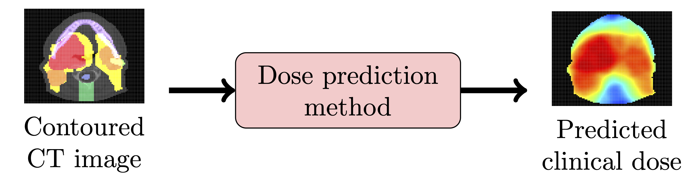
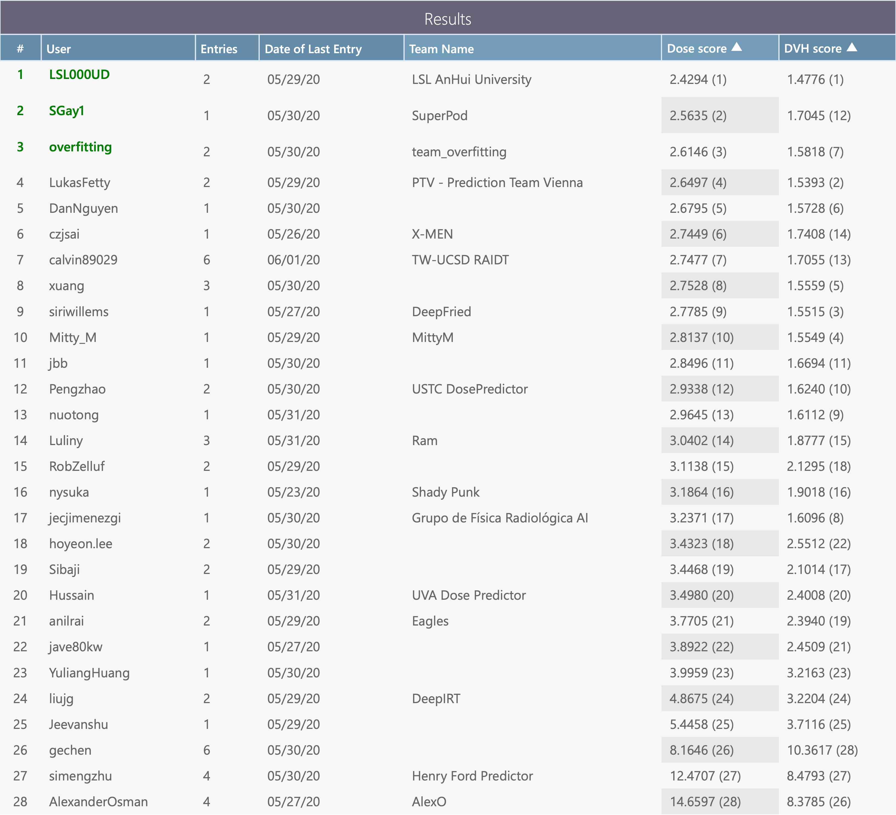

# OpenKBP Grand Challenge 


  
The _open-kbp_ repository provides code that is intended to get participants of the OpenKBP Challenge started with
dose prediction. The repository can be used on either a local machine or in the cloud (for free) using 
[Google Colab](https://colab.research.google.com).

 

**Advice**: Google Colab is a great way to compete in OpenKBP without putting a burden on your existing hardware. The
service provides high-quality CPUs and GPUs for free, however, your sessions are limited to consecutive 12 hours
  [[Frequently asked questions]](https://research.google.com/colaboratory/faq.html). 

# Table of Contents
- [Data](#data)
- [What this code does](#what-this-code-does)
- [Prerequisites](#prerequisites)
- [Created folder structure](#created-folder-structure)
- [Getting started...](#getting-started)
  + [in Colab](#getting-started-in-colab)
  + [on a local machine](#getting-started-on-a-local-machine)
- [Running the code...](#running-the-code)
  + [in Colab](#running-the-code-in-colab)
  + [on a local machine](#running-the-code-on-local-machine)
- [Competition results](#competition-results)
  + [First place](#first-place)
  + [Runners-up](#runners-up)
  + [Final testing phase leaderboard](#final-testing-phase-leaderboard)
- [Competition organizers](#competition-organizers)
- [Citation](#citation)

## Data
The details of the provided data are available in our paper [OpenKBP: The Open-Access 
Knowledge-Based Planning Grand Challenge](https://arxiv.org/abs/2011.14076). In short, we provide data for 340
patients who were treated for head-and-neck cancer with intensity modulated radiation therapy. The data is split into 
training ($n=200$), validation ($n=40$), and testing ($n=100$) sets. Every patient in these datasets has a
dose distribution, CT images, structure masks, a feasible dose mask (i.e., mask of where dose can be non-zero), and
voxel dimensions.

## What this code does
This code will train a small neural network to predict dose. There are five .py files that are required to run the
 _main\_notebook.ipynb_ and _main.py_ files. Below, we summarize the functionality of each .py file, but more details
  are provided in the files themselves.
  
  - _data_loader.py_: Contains the _DataLoader_ class, which loads the data from the dataset in a standard format.
   Several data formats (e.g., dose-volume histogram) are available to cater to different modeling techniques.
  - _dose_evaluation_class.py_: Contains the _EvaluateDose_ class, which is used to evaluate the competition metrics.
  - _general_functions.py_: Contain several functions with a variety of purposes. 
  - _network_architectures.py_: Contains the _DefineDoseFromCT_ class, which builds the architecture for a basic U-Net
   model. This class is inherited by the _PredictionModel_ class. Please note that we intentionally included a network
   architecture that is **not** state-of-the-art. It is only included to serve as a placeholder for your more 
   sophisticated models. 
  - _network_functions.py_: Contains the _PredictionModel_ class, which applies a series of methods on a model
   constructed in _DefineDoseFromCT_. 

## Prerequisites
The following are required to run the given notebook, however, for the competition you may use any hardware or
software you'd like. 

### For running on Google Colab
- Standard Google account 

### For running on a local machine
- Linux
- Python 3
- NVIDIA GPU with CUDA and CuDNN


## Created folder structure
This repository will create a file structure that branches from a directory called _open-kbp_. The file structure
will keep information about predictions from a model (called baseline in this example) and the model itself in the
 _results_ directory. All the data from the OpenKBP competition (with the original train/validation/test splits) is 
  available under the directory called _provided-data_. This code will also make a directory called _submissions_ to
   house the zip files that can be submitted to the leader boards on CodaLab. Use this folder tree as a reference 
   (it will more or less build itself).
   
```bash
open-kbp
├── provided-data
│   ├── train-pats
│   │   ├── pt_*
│   │       ├── *.csv
│   ├── valid-pats
│   │   ├── pt_*
│   │       ├── *.csv
│   └── test-pats
│       ├── pt_*
│           ├── *.csv
├── results
│   ├── baseline
│   │   ├── models
│   │   │   ├── epoch_*.h5
│   │   ├── hold-out-validation-predictions
│   │   │   ├── pt_*.csv
│   │   └── hold-out-testing-predictions
│   │       ├── pt_*.csv
│   ├── **Structure repeats when new model is made**
└── submissions
    ├── baseline.zip
    ├── **Structure repeats when new model is made**   

```

## Getting started
 Sign up for the OpenKBP competition of [CodaLab](https://competitions.codalab.org/competitions/?q=openkbp).
   
### Getting started in Colab
This should be the simplest way to compete in OpenKBP because the software required for dose prediction is installed
 in the cloud. It also means you can be competitive in OpenKBP without expensive hardware. All you need is a standard
  Google account with at least 2GB of available storage in your [Google Drive](https://drive.google.com). 

1. [Download](https://github.com/ababier/open-kbp-competition/archive/master.zip) this repository 
2. Make a directory in the _main_ directory of your Google Drive and name it _open-kbp_, henceforth referred to as
 the open-kbp directory.
3. Upload all the files in this repository to your open-kbp
 directory. It takes a while for the files to copy to Google Drive, and there is a small lag between when they're
  uploaded and when Colab can access them. We recommend you wait an extra 15 minutes after the data is uploaded before
   continuing.
4. Right-click the notebook file, and select: Open with > Google Colaboratory. This should open up a
 window where you can run the notebook in the cloud (for free!). 
5. In the Google Colab toolbar select: Runtime > Change Runtime. This will open another popup where you should ensure
 the runtime type is Python 3 and the hardware accelerator is GPU.
6. Run the first cell in the notebook to mount your google drive, and follow the prompts, which should include signing
 into your Google account. This cell will give Google Colab access to your Google Drive and your open-kbp directory.
 Keep in mind that there is sometimes a lag between what you see in your Drive and what you see in Colab. 

### Getting started on a local machine
1. Make a virtual environment and activate it
    ```
    virtualenv -p python3 open-kbp-venv
    source open-kbp-venv/bin/activate
    ```
2. Clone this repository, navigate to its directory, and install the requirements. Note, that to run Tensorflow 2.1
 with a GPU, you may need to build Tensorflow 2.1 from source. The official instructions to build from source are 
 [here ](https://www.tensorflow.org/install/source), but I found the third party guide [here](https://gist.github.com
 /kmhofmann/e368a2ebba05f807fa1a90b3bf9a1e03) more useful. 

    ```
    git clone https://github.com/ababier/open-kbp
    cd open-kbp
    pip3 install -r requirements.txt
    ```

## Running the code
Running the code in either platform should be straightforward. Any errors are likely the result of data being
 in an unexpected directory. If the code is running correctly then the progress of the neural network should print
  out to an output cell (Colab) or the commandline (local machine).
 
### Running the code in Colab
In the Google Colab toolbar select: Runtime > Run all; you can also use the key-binding <Ctrl+F9>.

**OR**

Run each cell individually by clicking the play button in each cell; you can also use the key binding <Shift+Enter>
to run a highlighted cell.

### Running the code on local machine
Run the main file in your newly created virtual environment.
    ```
    python3 main.py
    ```
Alternatively, you may run the notebook in Jupyter Notebook or Jupyter Lab locally, but only after commenting out the
 commands related to Google Drive and changing the paths for where the provided data is stored and where the results
  are saved.
  
  
## Competition results
The OpenKBP Challenge attracted 195 participants from 28 counties. The competition started February 21, 2020 and
 concluded on June 1, 2020. A total of 1750 submissions were made to the 
validation phase by the 44 teams (consisting of 73 people) who made at least 1 submission. In the testing phase, 28 
teams (consisting of 54 people) made submissions. The top teams in this competition are highlighted below.

### First place

**Dose and DVH Stream**: Shuolin Liu, Jingjing Zhang, Teng Li1, Hui Yan, Jianfei Liu, *LSL AnHui University*, Anhui
University, China. [\[GitHub Repository\]](https://github.com/LSL000UD/RTDosePrediction)

### Runners-up

**Dose Stream**: Mary P. Gronberg, Skylar S. Gay, Tucker J. Netherton, Dong Joo Rhee, Laurence E. Court, Carlos E. 
Cardenas, *SuperPod*, MD Anderson Cancer Center, United States.


**DVH Stream**: Lukas Zimmermann, Erik Faustmann, Christian Ramsl, Dietmar Georg, Gerd Heilemann, *PTV - Prediction
 Team Vienna*, Medical University of Vienna, Austria.

### Final testing phase leaderboard 
This leaderboard contains the final results of this challenge, which is the first controlled and blinded test of KBP
 method implementations from several institutions. Submissions to this leaderboard can still be made on CodaLab, however,
  since the results are no longer blinded there is no way to ensure the test set was used as intended (i.e., without any peaking). 
 
 

## Competition organizers
OpenKBP is organized by Aaron Babier, Binghao Zhang, Rafid Mahmood, and Timothy Chan (University of Toronto, Canada);
Andrea McNiven and Thomas Purdie (Princess Margaret Cancer Center, Canada); Kevin Moore (UC San Diego, USA). This
 challenge was supported by
[The American Association of Physicists in Medicine](https://www.aapm.org/GrandChallenge/OpenKBP/). 

## Citation
A. Babier, B. Zhang, R. Mahmood, K.L. Moore, T.G. Purdie, A.L. McNiven, T.C.Y. Chan, "OpenKBP: The 
Open-Access Knowledge-Based Planning Grand Challenge," under review at *Medical Physics*.
[\[arXiv\]](https://arxiv.org/abs/2011.14076)
